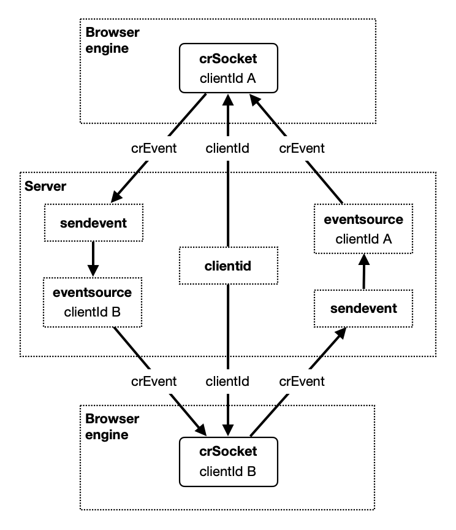

# Summary

The Controller-Responder Socket is a modular, event-driven client/server web app infrastructure that can be used to develop digital tasks where testers use a controller device to administer trials and a separate responder device to present stimuli and collect responses. In addition to providing a more streamlined and comfortable test situation, this approach may improve measurement quality because potentially distracting activities related to configuration and initiation of tasks are hidden from the participant. It also facilitates more flexible data collection protocols where testers can make real-time adjustments based on direct observations and feedback from various sources presented on the controller device. In addition to communication functionality, it also provides client-side buffering of events and server-side plug-in interfaces related to access control and data storage.

# Statement of need

The CRSocket component was originally developed for the Early Childhood Inhibitory Touch Task (ECITT). This is a suite of experimental psychology tasks designed to measure inhibitory behaviour using trials presented on tablet computers.

The primary novelty of the ECITT is that it can be "minimally modified to suit different ages, whilst remaining structurally equivalent" [@Holmboe2021]. This is the first task that can be used to measure inhibitory behaviour in a consistent way across the lifespan, from 18 months and upward.  In addition to the longitudinal validation publication, three studies related to specific age groups based on this task, have been published so far [@Lui2021], [@Hendry2022], [@Fiske2022].

Tablet computers and similar devices have become a natural part of daily life and are generally considered feasible for many types of data collection [@Frank2016], [@Semmelmann2016], [@Kanerva2019], but the abstract nature of such tasks still require careful consideration of potential sources of distraction [@Wenz2021] and adaption to individual differences among participants [@Jenkins2016]. Using digital tasks for developmental psychology experiments is particularly challenging. Infants are easily distracted and making them comfortable, motivated and capable of performing tasks is not trivial. In the ECITT this was accomplished by social interaction combined with simple games and priming trials on the responder device.

The task is currently being used for data collection in several research projects in Europe and the USA. To ensure data integrity it was necessary to implement a basic authentication scheme and continuous saving of responses in a shared repository. To avoid data loss it was also necessary to make communication problems visible for the tester without disturbing the participant.

Although the component was originally designed for cognitive psychology lab experiments, it may also contribute to improved measurement quality and the creation of novel tablet tasks for other purposes, including settings where testers are not located in the same room but are able to communicate in other ways, eg. via video channels.

# Architecture

To maximise reusability, the original software has been encapsulated in generic classes, using only built-in client- and server-side functionality and standard APIs. There are no global variables and no bindings to other parts of the ECITT software or external libraries. Client-side classes are implemented in JavaScript and server-side classes are implemented in PHP.

The component implements a relatively robust protocol for the identification and exchange of events between controller and responder processes. It is designed to handle various technical and human incidents that has been observed during testing. This includes differences between different browser engines, network issues, and challenges related to server functionality, resource usage and delays.

The protocol is asymmetric in the sense that only controller apps can establish and maintain communication channels. Responder apps can accept, reject, and abort connections, but they cannot actively approach controllers to establish new connections. Apart from that, controllers and responders interact as equal peers.

Authentication is based on access tokens. This facilitates integration with a wide range of authentication schemes ranging from simple user ids to advanced industry-standard protocols.

## The CRSocket class

The CrSocket class is used by controller and responder client apps to establish communication channels, exchange CREvent objects, and monitor communication states. CRSocket objects are instantiated with a client role which can be either "controller" or “responder" and a CRConfig object which, among other things, contains an application id that identifies a controller/responder web app pair.

The first time a CRSocket object is instantiated, it is assigned a server-generated client id. This id is associated with the current combination of application id / client role within the current engine. It is saved in the engine's localStorage object and can be reused in subsequent instantiations to establish communication channels between active CRSocket objects in all major browser engines.

The CRSocket is implemented as a state machine, with well defined set of states and state transitions. Event reception and state changes are communicated by means of standard JavaScript event APIs.

## The CREvent class

This clas, with mirroring implementations in JavaScript and PHP, represents events that can be transmitted between controller and responder CrSocket objects. These events may contain any number of text-convertible parameters. They also contain flags related to buffering, logging, and server-side interception.

## Server resources

The component provides default implementations of resources that must be available on the server:

* **clientid**. This resource generates a new, unique clientId, and returns an XML document containing this id to the requesting client.
* **eventsource**. This resource transmits a stream of events, representing CREvent objects and internal events from the server to the client, formatted as server-sent events.
* **sendevent**. This resource receives a single event from a client, formatted as an HTTP GET request and transmits it to an eventsource process.

 Server-side functionality can be replaced by other implementations as long as the resources described above conform to their respective specifications.
 
 Both eventsource and sendevent resources may contain server-side event plugin mechanisms that can be used to implement authentication schemes, storage functionality and various types of event processing.

# Acknowledgements

I would like to thank Andrew Simpson who came up with the original idea and Karla Holmboe who brought it into light by contributing with methodological expertice and integration into several developmental psychology research projects. I also appreciate the work of all the testers who provided useful feedback while patiently dealing with bugs and deficiencies.

# References
